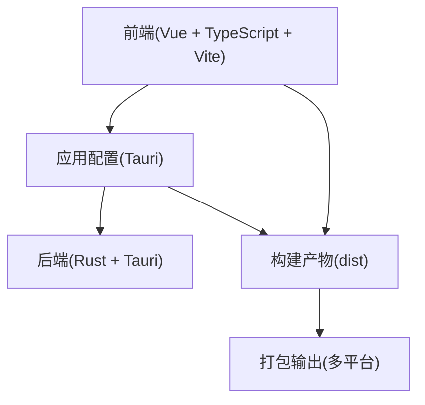
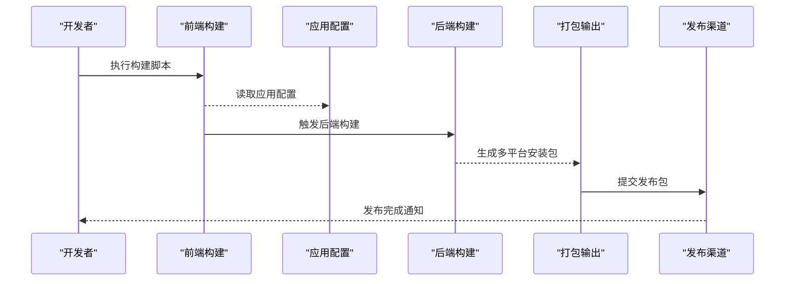
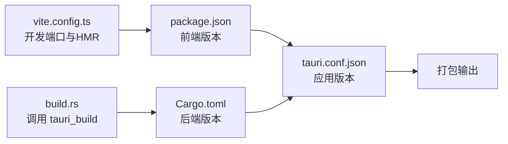

# 版本管理与发布

<cite>
**本文档引用的文件**
- [package.json](file://package.json)
- [Cargo.toml](file://src-tauri/Cargo.toml)
- [tauri.conf.json](file://src-tauri/tauri.conf.json)
- [build.rs](file://src-tauri/build.rs)
- [vite.config.ts](file://vite.config.ts)
- [AGENTS.md](file://AGENTS.md)
- [README.md](file://README.md)
</cite>

## 目录
1. [简介](#简介)
2. [项目结构](#项目结构)
3. [核心组件](#核心组件)
4. [架构总览](#架构总览)
5. [详细组件分析](#详细组件分析)
6. [依赖关系分析](#依赖关系分析)
7. [性能考虑](#性能考虑)
8. [故障排除指南](#故障排除指南)
9. [结论](#结论)
10. [附录](#附录)

## 简介
本指南面向使用 Tauri + Vue + TypeScript 技术栈的桌面应用团队，系统化阐述版本管理与发布流程。当前仓库采用统一的版本号（0.1.0）管理前端、后端与应用配置，尚未配置自动化发布流水线或变更日志生成工具。本指南在现有基础上提供可落地的版本策略、发布前质量检查清单、更新机制建议、发布渠道选择、回滚与紧急修复流程，以及持续集成与自动化发布的配置思路。

## 项目结构
该仓库采用前后端分离的桌面应用结构：
- 前端：Vue 3 + TypeScript + Vite，入口为 [main.ts](file://src/main.ts)，开发服务器端口固定为 1420。
- 后端：Rust（通过 Tauri 2），包名与版本在 [Cargo.toml](file://src-tauri/Cargo.toml) 中定义。
- 应用配置：Tauri 配置在 [tauri.conf.json](file://src-tauri/tauri.conf.json)，包含产品名称、版本、打包目标与图标等。
- 构建脚本：前端构建命令在 [package.json](file://package.json) 的 scripts 字段中定义；Rust 构建入口在 [build.rs](file://src-tauri/build.rs) 调用 tauri_build。

**图表来源**
- [vite.config.ts:1-33](file://vite.config.ts#L1-L33)
- [tauri.conf.json:1-36](file://src-tauri/tauri.conf.json#L1-L36)
- [Cargo.toml:1-26](file://src-tauri/Cargo.toml#L1-L26)

**章节来源**
- [package.json:1-25](file://package.json#L1-L25)
- [Cargo.toml:1-26](file://src-tauri/Cargo.toml#L1-L26)
- [tauri.conf.json:1-36](file://src-tauri/tauri.conf.json#L1-L36)
- [vite.config.ts:1-33](file://vite.config.ts#L1-L33)

## 核心组件
- 版本号来源
  - 前端版本：位于 [package.json](file://package.json#L4)。
  - 后端版本：位于 [Cargo.toml](file://src-tauri/Cargo.toml#L3)。
  - 应用版本：位于 [tauri.conf.json](file://src-tauri/tauri.conf.json#L4)。
- 构建与打包
  - 前端构建：通过 [package.json](file://package.json#L8) 定义的构建脚本执行类型检查与打包。
  - 应用打包：Tauri 配置中的 [tauri.conf.json:24-34](file://src-tauri/tauri.conf.json#L24-L34) 指定打包目标为 "all"，包含多平台图标资源。
- 开发环境
  - Vite 开发服务器端口固定为 1420，热更新端口为 1421（当设置 TAURI_DEV_HOST 时），参见 [vite.config.ts:16-26](file://vite.config.ts#L16-L26)。

**章节来源**
- [package.json:1-25](file://package.json#L1-L25)
- [Cargo.toml:1-26](file://src-tauri/Cargo.toml#L1-L26)
- [tauri.conf.json:1-36](file://src-tauri/tauri.conf.json#L1-L36)
- [vite.config.ts:1-33](file://vite.config.ts#L1-L33)

## 架构总览
下图展示了从开发到发布的整体流程，涵盖版本号同步、构建与打包、以及发布渠道准备。

**图表来源**
- [package.json:6-11](file://package.json#L6-L11)
- [tauri.conf.json:6-11](file://src-tauri/tauri.conf.json#L6-L11)
- [build.rs:1-4](file://src-tauri/build.rs#L1-L4)

## 详细组件分析

### 版本号管理与语义化版本控制
- 当前状态
  - 前端、后端与应用配置均使用相同版本号 0.1.0，便于统一管理与发布。
- 推荐实践
  - 语义化版本控制（SemVer）：主版本号.次版本号.修订号（MAJOR.MINOR.PATCH）
    - MAJOR：破坏性变更
    - MINOR：向后兼容的功能新增
    - PATCH：向后兼容的问题修正
  - 版本更新策略
    - 功能迭代：递增 MINOR，并重置 PATCH 为 0
    - 问题修复：递增 PATCH
    - 破坏性变更：递增 MAJOR，并重置 MINOR 与 PATCH
  - 版本同步
    - 在同一发布周期内，保持 package.json、Cargo.toml 与 tauri.conf.json 的版本一致，避免消费者混淆。
  - 变更日志
    - 建议采用基于时间的发布节奏，每个版本记录重大变更、修复与已知问题，遵循“按类别分组”的格式规范（例如：新增、改进、修复、安全）。

**章节来源**
- [package.json](file://package.json#L4)
- [Cargo.toml](file://src-tauri/Cargo.toml#L3)
- [tauri.conf.json](file://src-tauri/tauri.conf.json#L4)

### 变更日志维护方法与格式规范
- 维护方式
  - 建议在每次发布前更新变更日志，记录自上一版本以来的所有重要改动。
  - 将变更日志与版本号同步，确保发布包附带对应版本的变更说明。
- 格式规范
  - 标题层级：使用二级标题标识版本号与发布日期
  - 分类组织：按“新增”“改进”“修复”“安全”等分类列出条目
  - 行文风格：简洁明确，避免模糊描述；必要时附带相关 issue 或 PR 编号
  - 语言一致性：统一使用中文，便于国内用户理解

[本节为通用实践说明，不直接分析具体文件，故无“章节来源”]

### 发布前质量检查清单
- 功能测试
  - 端到端验证核心业务流程，覆盖主要窗口与交互
  - 回归测试：对最近一次发布以来的修复进行回归验证
- 性能测试
  - 内存占用与启动时间监控，对比基准版本
  - 大数据量场景下的稳定性测试
- 兼容性测试
  - 多平台验证：Windows、macOS、Linux
  - 不同系统版本与桌面环境的兼容性
- 安全与合规
  - 依赖漏洞扫描与许可证合规检查
  - 应用签名与权限最小化审查
- 用户验收
  - 生成预发布版本供内部或邀请用户试用，收集反馈

[本节为通用实践说明，不直接分析具体文件，故无“章节来源”]

### 应用更新机制实现方案
- 自动更新
  - 方案概述：在应用启动时检查远程更新源，若存在新版本则提示并下载安装包，重启后生效
  - 关键点：更新源需提供版本元数据与校验信息；更新包需具备数字签名；更新过程需保证原子性与可回滚
- 手动更新
  - 方案概述：通过应用内链接跳转至官网或应用商店页面，引导用户下载最新安装包
  - 关键点：确保下载地址稳定且与当前平台匹配；提供清晰的更新说明与风险提示
- 权限与安全
  - 更新权限：根据需要授予网络访问与写入安装目录的最小权限
  - 数据保护：更新过程中避免丢失用户数据；失败时保留原版本不变

[本节为通用实践说明，不直接分析具体文件，故无“章节来源”]

### 发布渠道选择与管理
- 应用商店发布
  - Windows：Microsoft Store、第三方软件站
  - macOS：Mac App Store、开发者网站直发
  - Linux：Snap、Flatpak、AppImage 等生态
- 官网下载
  - 提供多平台安装包与校验文件（哈希值、签名）
  - 保持下载链接长期有效，定期检查可用性
- 渠道一致性
  - 各渠道版本号与变更说明保持一致，避免用户困惑
  - 对于紧急修复，优先在官网与应用商店同步发布

[本节为通用实践说明，不直接分析具体文件，故无“章节来源”]

### 回滚策略与紧急修复流程
- 回滚策略
  - 快速回滚：保留上一稳定版本的安装包，支持一键恢复
  - 数据迁移：若涉及数据库或配置文件变更，提供迁移脚本与备份
- 紧急修复
  - 识别与评估：快速定位问题影响范围与严重程度
  - 修复与验证：在隔离环境中完成修复与测试
  - 发布与通告：发布紧急补丁并同步更新说明，跟踪用户反馈

[本节为通用实践说明，不直接分析具体文件，故无“章节来源”]

### 持续集成与自动化发布
- CI/CD 流水线建议
  - 触发条件：分支推送、PR 合并、标签创建
  - 步骤组成：代码检查、单元测试、构建、打包、签名、上传、发布
- 版本与标签
  - 使用 Git 标签标记发布版本，命名规范建议采用 vMAJOR.MINOR.PATCH
  - 自动化脚本读取标签并同步更新各处版本号
- 工件管理
  - 将构建产物与签名文件归档，便于审计与回溯
  - 对外发布前进行二次校验（哈希、签名）

[本节为通用实践说明，不直接分析具体文件，故无“章节来源”]

## 依赖关系分析
- 版本号耦合
  - 前端、后端与应用配置共享版本号，降低发布时的不一致风险
- 构建链路
  - 前端构建依赖 Vite 与 TypeScript；后端构建依赖 Rust 生态与 Tauri CLI
  - 应用配置决定打包目标与图标资源，直接影响最终安装包形态

**图表来源**
- [package.json](file://package.json#L4)
- [Cargo.toml](file://src-tauri/Cargo.toml#L3)
- [tauri.conf.json](file://src-tauri/tauri.conf.json#L4)
- [vite.config.ts:16-26](file://vite.config.ts#L16-L26)
- [build.rs:1-4](file://src-tauri/build.rs#L1-L4)

**章节来源**
- [package.json:1-25](file://package.json#L1-L25)
- [Cargo.toml:1-26](file://src-tauri/Cargo.toml#L1-L26)
- [tauri.conf.json:1-36](file://src-tauri/tauri.conf.json#L1-L36)
- [vite.config.ts:1-33](file://vite.config.ts#L1-L33)
- [build.rs:1-4](file://src-tauri/build.rs#L1-L4)

## 性能考虑
- 版本号同步成本
  - 统一版本号可减少发布前的协调成本，但需确保所有相关文件在同一变更窗口内更新
- 构建与打包效率
  - 利用增量构建与缓存策略，缩短 CI 时间
  - 对大型依赖进行预编译或镜像加速
- 发布后监控
  - 收集崩溃报告与性能指标，为后续优化提供依据

[本节提供一般性指导，不直接分析具体文件，故无“章节来源”]

## 故障排除指南
- 版本号不同步
  - 症状：发布后应用显示版本不一致
  - 处理：统一更新 package.json、Cargo.toml 与 tauri.conf.json 的版本字段
- 开发端口冲突
  - 症状：启动失败或 HMR 不工作
  - 处理：确认 1420/1421 端口未被占用；在需要时设置 TAURI_DEV_HOST
- 打包目标缺失
  - 症状：仅生成部分平台安装包
  - 处理：检查 tauri.conf.json 中的 targets 设置为 "all" 并确保图标资源齐全

**章节来源**
- [vite.config.ts:16-26](file://vite.config.ts#L16-L26)
- [tauri.conf.json:24-34](file://src-tauri/tauri.conf.json#L24-L34)

## 结论
当前仓库已具备统一版本号与基础构建能力。建议在现有基础上完善变更日志、发布前质量检查、更新机制与发布渠道管理，并引入 CI/CD 实现自动化发布。通过严格的版本策略与流程规范，可显著提升发布效率与质量，保障用户体验与安全性。

[本节为总结性内容，不直接分析具体文件，故无“章节来源”]

## 附录
- 开发与构建命令参考
  - 开发：参见 [AGENTS.md:13-24](file://AGENTS.md#L13-L24)
  - 类型检查：参见 [AGENTS.md:26-29](file://AGENTS.md#L26-L29)
  - 项目结构概览：参见 [AGENTS.md:73-90](file://AGENTS.md#L73-L90)
- 技术栈与 IDE 建议
  - 技术栈：参见 [AGENTS.md:5-9](file://AGENTS.md#L5-L9)
  - IDE 推荐：参见 [README.md:5-16](file://README.md#L5-L16)

**章节来源**
- [AGENTS.md:1-115](file://AGENTS.md#L1-L115)
- [README.md:1-17](file://README.md#L1-L17)