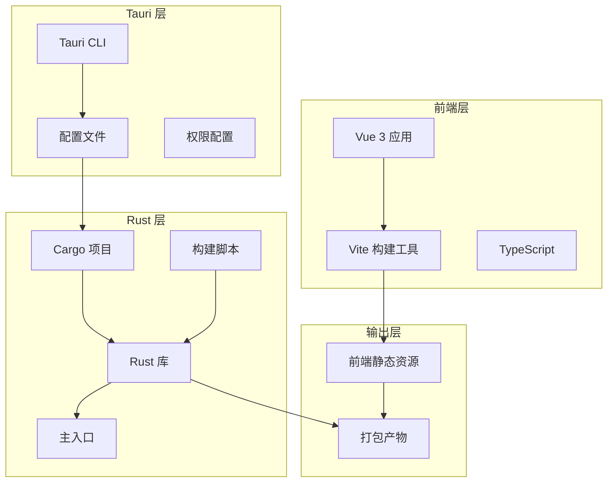
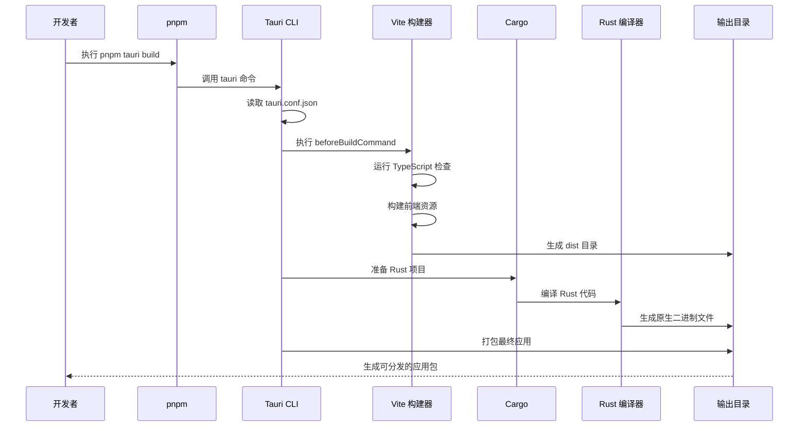
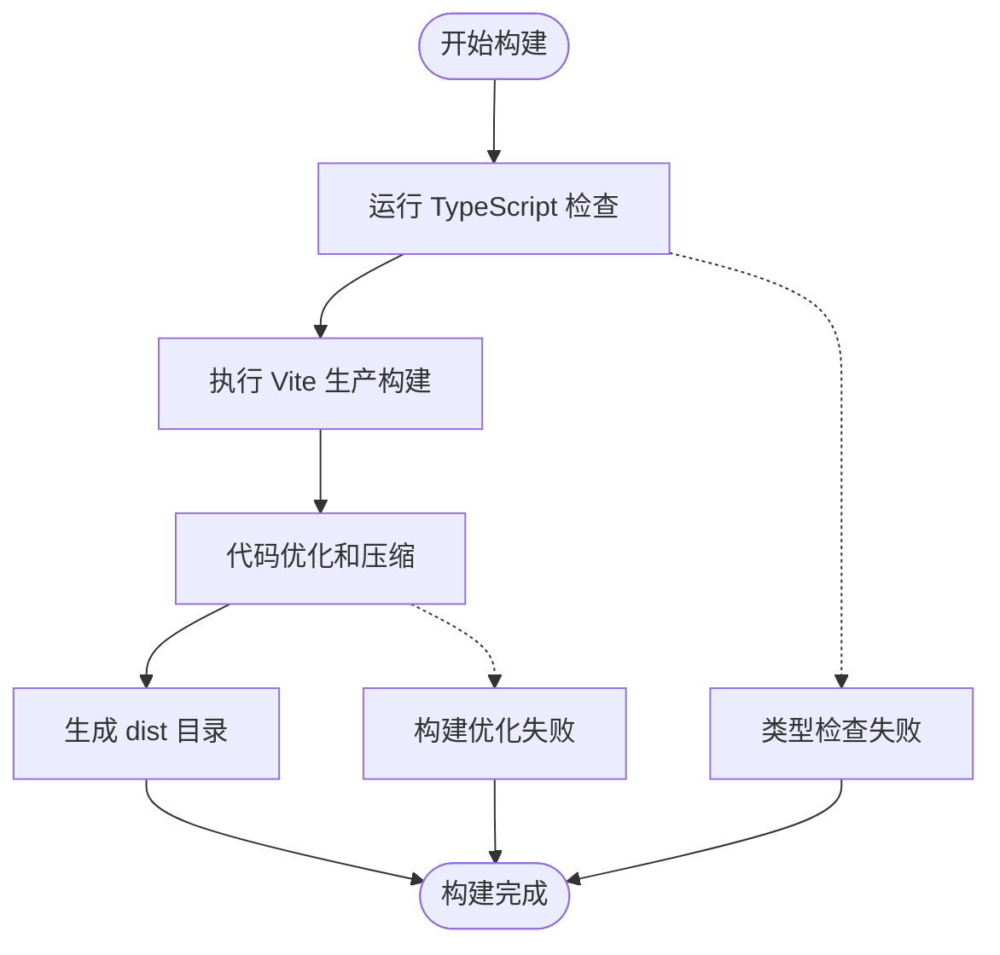
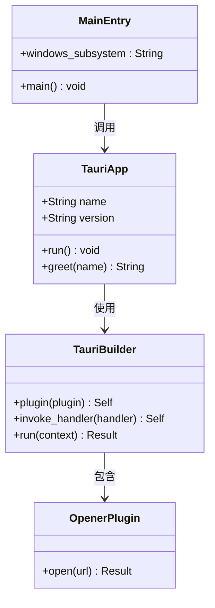
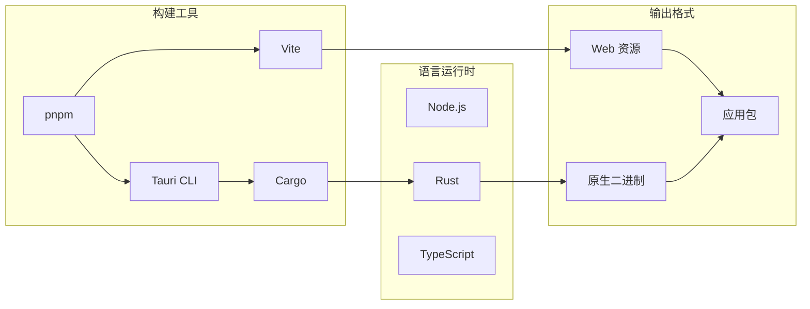

# 生产环境构建

<cite>
**本文档引用的文件**
- [package.json](file://package.json)
- [vite.config.ts](file://vite.config.ts)
- [src-tauri/tauri.conf.json](file://src-tauri/tauri.conf.json)
- [src-tauri/Cargo.toml](file://src-tauri/Cargo.toml)
- [src-tauri/src/main.rs](file://src-tauri/src/main.rs)
- [src-tauri/src/lib.rs](file://src-tauri/src/lib.rs)
- [src-tauri/build.rs](file://src-tauri/build.rs)
- [src-tauri/capabilities/default.json](file://src-tauri/capabilities/default.json)
- [README.md](file://README.md)
</cite>

## 目录
1. [简介](#简介)
2. [项目结构](#项目结构)
3. [核心组件](#核心组件)
4. [架构概览](#架构概览)
5. [详细组件分析](#详细组件分析)
6. [依赖关系分析](#依赖关系分析)
7. [性能考虑](#性能考虑)
8. [故障排除指南](#故障排除指南)
9. [结论](#结论)
10. [附录](#附录)

## 简介
本指南专注于 Tauri 应用的生产环境构建流程，详细解释 pnpm tauri build 命令的工作原理、构建配置选项、开发与生产环境差异，以及构建性能优化策略。通过分析项目中的配置文件，我们将提供可操作的最佳实践和故障排除方法。

## 项目结构
该项目采用典型的 Tauri + Vue + TypeScript 架构，前端使用 Vite 进行构建，后端使用 Rust 编写原生逻辑。

**图表来源**
- [package.json:1-25](file://package.json#L1-L25)
- [vite.config.ts:1-33](file://vite.config.ts#L1-L33)
- [src-tauri/tauri.conf.json:1-36](file://src-tauri/tauri.conf.json#L1-L36)
- [src-tauri/Cargo.toml:1-26](file://src-tauri/Cargo.toml#L1-L26)

**章节来源**
- [package.json:1-25](file://package.json#L1-L25)
- [vite.config.ts:1-33](file://vite.config.ts#L1-L33)
- [src-tauri/tauri.conf.json:1-36](file://src-tauri/tauri.conf.json#L1-L36)
- [src-tauri/Cargo.toml:1-26](file://src-tauri/Cargo.toml#L1-L26)

## 核心组件
本节详细介绍生产环境构建涉及的核心组件及其职责。

### 前端构建系统
前端使用 Vite 进行生产环境构建，配合 TypeScript 类型检查确保代码质量。

### Tauri 配置管理
Tauri 的配置文件定义了构建行为、打包选项和应用元数据。

### Rust 后端集成
Rust 代码作为应用的核心逻辑，通过 Tauri API 暴露给前端调用。

**章节来源**
- [package.json:6-11](file://package.json#L6-L11)
- [vite.config.ts:8-32](file://vite.config.ts#L8-L32)
- [src-tauri/tauri.conf.json:6-11](file://src-tauri/tauri.conf.json#L6-L11)

## 架构概览
生产环境构建流程展示了从前端到原生应用的完整转换过程。

**图表来源**
- [package.json:8](file://package.json#L8)
- [src-tauri/tauri.conf.json:9-10](file://src-tauri/tauri.conf.json#L9-L10)
- [src-tauri/Cargo.toml:1-26](file://src-tauri/Cargo.toml#L1-L26)

## 详细组件分析

### 构建配置详解

#### 前端构建配置
前端构建通过 Vite 完成，配置中包含了针对 Tauri 开发的特殊设置。

**图表来源**
- [package.json:8](file://package.json#L8)
- [vite.config.ts:14-31](file://vite.config.ts#L14-L31)

#### Tauri 构建配置
Tauri 的构建配置定义了完整的构建流程和输出规范。

**章节来源**
- [vite.config.ts:8-32](file://vite.config.ts#L8-L32)
- [src-tauri/tauri.conf.json:6-11](file://src-tauri/tauri.conf.json#L6-L11)

### 关键构建选项解析

#### beforeBuildCommand 选项
该选项指定在构建前执行的命令，确保前端资源在 Rust 编译之前准备就绪。

#### frontendDist 选项
定义前端构建输出目录的位置，Tauri 将在此目录查找静态资源。

#### bundle 配置
控制应用打包行为，支持多种目标平台的自动检测和打包。

**章节来源**
- [src-tauri/tauri.conf.json:9-10](file://src-tauri/tauri.conf.json#L9-L10)
- [src-tauri/tauri.conf.json:24-34](file://src-tauri/tauri.conf.json#L24-L34)

### Rust 项目结构
Rust 项目作为应用的核心，提供了跨平台的原生功能支持。

**图表来源**
- [src-tauri/src/lib.rs:1-15](file://src-tauri/src/lib.rs#L1-L15)
- [src-tauri/src/main.rs:1-7](file://src-tauri/src/main.rs#L1-L7)
- [src-tauri/Cargo.toml:20-25](file://src-tauri/Cargo.toml#L20-L25)

**章节来源**
- [src-tauri/src/lib.rs:1-15](file://src-tauri/src/lib.rs#L1-L15)
- [src-tauri/src/main.rs:1-7](file://src-tauri/src/main.rs#L1-L7)
- [src-tauri/Cargo.toml:10-15](file://src-tauri/Cargo.toml#L10-L15)

### 权限配置系统
应用的权限配置定义了允许访问的功能和 API。

**章节来源**
- [src-tauri/capabilities/default.json:1-11](file://src-tauri/capabilities/default.json#L1-L11)

## 依赖关系分析

### 构建工具链依赖
构建过程涉及多个工具链的协调工作。

**图表来源**
- [package.json:17-23](file://package.json#L17-L23)
- [src-tauri/Cargo.toml:17-25](file://src-tauri/Cargo.toml#L17-L25)

### 版本兼容性矩阵
不同组件版本之间的兼容性要求。

**章节来源**
- [package.json:12-23](file://package.json#L12-L23)
- [src-tauri/Cargo.toml:20-25](file://src-tauri/Cargo.toml#L20-L25)

## 性能考虑

### 构建时间优化策略
为提高生产环境构建效率，建议采用以下策略：

#### 并行构建
利用多核处理器优势，同时编译前端和后端代码。

#### 缓存机制
- 前端构建缓存：利用 Vite 的内置缓存机制
- Rust 编译缓存：启用 Cargo 的增量编译
- 依赖缓存：pnpm 的高效依赖管理

#### 代码分割
- 按需加载非关键模块
- 动态导入大型库
- 移除未使用的代码

#### 优化配置
- 生产模式下的代码压缩
- 图片和字体的优化处理
- 第三方库的 Tree Shaking

### 内存使用优化
- 设置合理的堆大小限制
- 避免内存泄漏
- 及时释放临时文件

**章节来源**
- [vite.config.ts:14-16](file://vite.config.ts#L14-L16)
- [src-tauri/Cargo.toml:17-18](file://src-tauri/Cargo.toml#L17-L18)

## 故障排除指南

### 常见构建问题及解决方案

#### 依赖冲突问题
**症状**：构建过程中出现版本不兼容错误
**解决方案**：
1. 清理依赖缓存并重新安装
2. 检查 package.json 和 Cargo.toml 中的版本约束
3. 使用锁定文件确保依赖版本一致性

#### 配置错误
**症状**：构建失败或应用无法正常启动
**解决方案**：
1. 验证 tauri.conf.json 的语法正确性
2. 检查路径配置是否正确
3. 确认权限配置符合应用需求

#### 端口占用问题
**症状**：开发服务器无法启动
**解决方案**：
1. 检查 1420 端口是否被其他进程占用
2. 修改 Vite 配置中的端口号
3. 使用 `strictPort: false` 允许自动选择端口

#### Rust 编译错误
**症状**：Rust 代码编译失败
**解决方案**：
1. 检查 Rust 工具链版本
2. 更新依赖到兼容版本
3. 清理 Cargo 缓存后重试

#### 前端资源缺失
**症状**：应用启动后显示空白页面
**解决方案**：
1. 确认 dist 目录已正确生成
2. 检查 frontendDist 配置路径
3. 验证静态资源的完整性

### 调试技巧
- 启用详细日志输出
- 使用 `--verbose` 参数获取更多信息
- 分步骤验证每个构建阶段
- 检查中间产物的完整性

**章节来源**
- [vite.config.ts:16-26](file://vite.config.ts#L16-L26)
- [src-tauri/tauri.conf.json:9-10](file://src-tauri/tauri.conf.json#L9-L10)

## 结论
生产环境构建是一个复杂但可管理的过程，涉及前端、后端和打包工具的协调工作。通过理解配置选项的作用机制、采用适当的优化策略和建立完善的故障排除流程，可以显著提高构建效率和成功率。建议在持续集成环境中实施标准化的构建流程，确保每次构建的一致性和可靠性。

## 附录

### 最佳实践清单
- 在 CI/CD 中使用锁定文件确保环境一致性
- 实施多阶段构建以提高缓存利用率
- 建立构建产物的完整性校验机制
- 定期更新依赖以获得安全补丁和性能改进

### 快速参考
- 构建命令：`pnpm tauri build`
- 开发命令：`pnpm tauri dev`
- 预览命令：`pnpm preview`
- 类型检查：`pnpm build`（包含 TypeScript 检查）

### 支持信息
如需进一步的技术支持，请参考官方文档和社区资源。