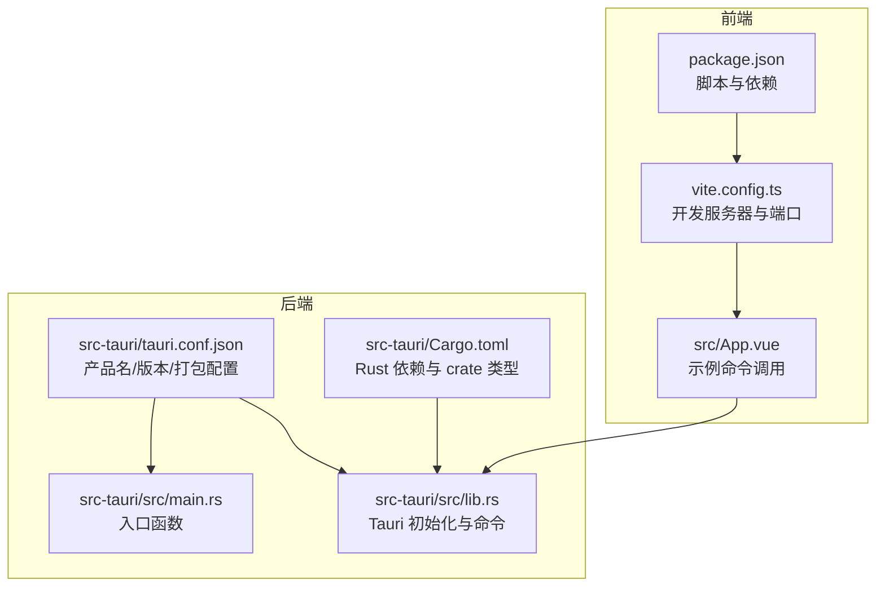
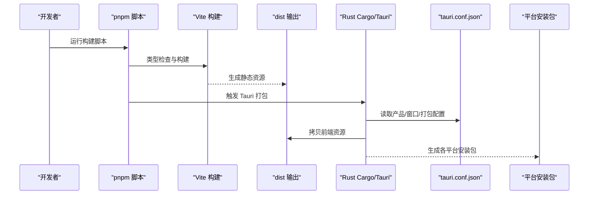
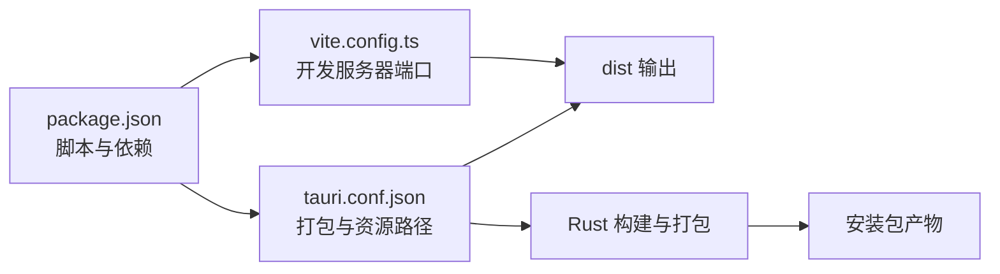

# 部署指南

<cite>
**本文引用的文件**
- [package.json](file://package.json)
- [vite.config.ts](file://vite.config.ts)
- [src-tauri/tauri.conf.json](file://src-tauri/tauri.conf.json)
- [src-tauri/Cargo.toml](file://src-tauri/Cargo.toml)
- [src-tauri/src/main.rs](file://src-tauri/src/main.rs)
- [src-tauri/src/lib.rs](file://src-tauri/src/lib.rs)
- [src/App.vue](file://src/App.vue)
- [AGENTS.md](file://AGENTS.md)
- [README.md](file://README.md)
</cite>

## 目录
1. [简介](#简介)
2. [项目结构](#项目结构)
3. [核心组件](#核心组件)
4. [架构总览](#架构总览)
5. [详细组件分析](#详细组件分析)
6. [依赖关系分析](#依赖关系分析)
7. [性能考虑](#性能考虑)
8. [故障排除指南](#故障排除指南)
9. [结论](#结论)
10. [附录](#附录)

## 简介
本指南面向使用 Tauri 2 + Vue 3 + TypeScript 的桌面应用团队，提供从开发到生产的完整部署与发布流程。内容覆盖生产构建命令、多平台打包策略、签名与公证（macOS）、数字签名（Windows）、安装包制作（NSIS、DMG、AppImage）、应用更新与自动更新、版本管理与变更日志、发布前质量保证检查、持续集成与自动化部署，以及常见问题排查。

## 项目结构
该仓库采用前后端分离的 Tauri 架构：前端为 Vue 3 + TypeScript + Vite，后端为 Rust（通过 Tauri）。构建时前端产物输出至 dist 目录，由 Rust 后端在运行时加载。

图表来源
- [package.json:1-25](file://package.json#L1-L25)
- [vite.config.ts:1-33](file://vite.config.ts#L1-L33)
- [src-tauri/tauri.conf.json:1-36](file://src-tauri/tauri.conf.json#L1-L36)
- [src-tauri/Cargo.toml:1-26](file://src-tauri/Cargo.toml#L1-L26)
- [src-tauri/src/main.rs:1-7](file://src-tauri/src/main.rs#L1-L7)
- [src-tauri/src/lib.rs:1-15](file://src-tauri/src/lib.rs#L1-L15)

章节来源
- [package.json:1-25](file://package.json#L1-L25)
- [vite.config.ts:1-33](file://vite.config.ts#L1-L33)
- [src-tauri/tauri.conf.json:1-36](file://src-tauri/tauri.conf.json#L1-L36)
- [src-tauri/Cargo.toml:1-26](file://src-tauri/Cargo.toml#L1-L26)
- [AGENTS.md:1-115](file://AGENTS.md#L1-L115)

## 核心组件
- 前端构建与开发服务器
  - 使用 Vite 在固定端口提供开发体验，并在 Tauri 开发模式下与 Rust 后端联动。
  - 生产构建通过脚本生成 dist 目录供后端打包使用。
- Rust 后端与 Tauri 集成
  - 通过 tauri.conf.json 配置产品信息、窗口属性、安全策略与打包目标。
  - 通过 Cargo.toml 管理 Rust 依赖与 crate 类型，确保跨平台可执行文件生成。
- 示例命令与调用
  - 前端通过 @tauri-apps/api 调用 Rust 命令，展示 IPC 交互方式。

章节来源
- [vite.config.ts:1-33](file://vite.config.ts#L1-L33)
- [package.json:6-11](file://package.json#L6-L11)
- [src-tauri/tauri.conf.json:6-23](file://src-tauri/tauri.conf.json#L6-L23)
- [src-tauri/Cargo.toml:10-25](file://src-tauri/Cargo.toml#L10-L25)
- [src/App.vue:1-160](file://src/App.vue#L1-L160)

## 架构总览
下图展示了从开发到打包的关键流程：前端类型检查与构建 → 生成 dist → Rust 后端读取配置并打包 → 多平台安装包生成。

图表来源
- [package.json:6-11](file://package.json#L6-L11)
- [vite.config.ts:1-33](file://vite.config.ts#L1-L33)
- [src-tauri/tauri.conf.json:6-34](file://src-tauri/tauri.conf.json#L6-L34)

## 详细组件分析

### 生产构建流程与 pnpm tauri build
- 基本流程
  - 先执行前端类型检查与构建，再触发 Tauri 打包，最终生成多平台安装包。
  - 开发服务器端口与热更新策略在 Vite 配置中固定，便于 Tauri Dev 模式协作。
- 关键配置点
  - 前端构建入口与输出目录由 tauri.conf.json 的前端资源路径决定。
  - 开发前与构建前命令分别指向前端开发与构建脚本，确保环境一致性。
- 可选参数与扩展
  - Tauri CLI 支持指定目标、通道与输出目录等参数；建议在 CI 中显式传入以保证可重复性。
  - 如需自定义图标、权限或窗口行为，可在 tauri.conf.json 对应字段进行调整。

章节来源
- [AGENTS.md:19-24](file://AGENTS.md#L19-L24)
- [vite.config.ts:11-31](file://vite.config.ts#L11-L31)
- [src-tauri/tauri.conf.json:6-11](file://src-tauri/tauri.conf.json#L6-L11)

### 多平台打包策略
- 平台目标
  - 当前配置为“全部平台”，实际打包会根据本地工具链生成对应平台包。
- Windows
  - 使用 NSIS 或 Wix 制作安装器；需要准备 .ico 图标与证书用于数字签名。
  - 建议启用代码签名与验证，避免被安全软件拦截。
- macOS
  - 使用 DMG 容器分发；需完成应用签名与公证，满足 Gatekeeper 要求。
  - 建议使用 Notarization Service 提交公证请求，附带必需的 entitlements。
- Linux
  - 推荐 AppImage 作为便携安装格式；也可生成 DEB/RPM 以适配发行渠道。
  - 注意依赖与运行时环境，必要时打包系统库或提供运行时依赖声明。

章节来源
- [src-tauri/tauri.conf.json:24-34](file://src-tauri/tauri.conf.json#L24-L34)

### 应用签名与公证
- Windows 数字签名
  - 使用代码签名证书对可执行文件与安装包进行签名，提升信任度与免误报率。
  - 在 CI 中安全存储证书与密码，签名后进行时间戳与时戳服务器验证。
- macOS Gatekeeper 与公证
  - 对应用二进制进行签名，包含 Info.plist、可执行文件与嵌入资源。
  - 提交 Apple Notary Service 进行公证，返回票据后合并回应用包。
  - 确保 entitlements 与权限声明与应用功能一致，避免公证失败。

章节来源
- [src-tauri/tauri.conf.json:24-34](file://src-tauri/tauri.conf.json#L24-L34)

### 安装程序制作
- NSIS（Windows）
  - 配置安装向导、快捷方式、注册表项与卸载项；与签名流程结合。
  - 建议支持静默安装与升级场景。
- DMG（macOS）
  - 使用制作工具生成可拖拽的磁盘映像，包含已签名应用与校验文件。
  - 可添加背景图、布局与隐藏元数据以提升用户体验。
- AppImage（Linux）
  - 将应用与运行时打包为单一可执行文件，便于分发与运行。
  - 注意权限与沙箱策略，确保在不同发行版上兼容。

章节来源
- [src-tauri/tauri.conf.json:24-34](file://src-tauri/tauri.conf.json#L24-L34)

### 应用更新与自动更新
- 更新机制设计
  - 前端通过 Tauri API 检查版本与下载更新；后端负责解压与替换资源。
  - 建议采用增量更新或全量更新策略，结合哈希校验保障完整性。
- 自动更新实现
  - 在应用启动时或后台定时检查更新；用户确认后执行安装。
  - 对于 macOS，公证后的签名有助于减少 Gatekeeper 弹窗。
  - 对于 Windows，签名与发布渠道（如 Microsoft Store 或自有网站）影响信任级别。

章节来源
- [src-tauri/src/lib.rs:1-15](file://src-tauri/src/lib.rs#L1-L15)
- [src-tauri/tauri.conf.json:20-23](file://src-tauri/tauri.conf.json#L20-L23)

### 版本管理与变更日志
- 语义化版本控制
  - 使用主版本.次版本.修订号格式；遵循语义化规则进行版本递增。
- 变更日志维护
  - 记录重大修复、新增功能与破坏性变更；与发布标签关联。
- 发布标签与分支策略
  - 建议使用稳定分支与预发布标签区分正式版本与候选版本。

章节来源
- [package.json:3-5](file://package.json#L3-L5)
- [src-tauri/Cargo.toml:2-4](file://src-tauri/Cargo.toml#L2-L4)

### 发布前质量保证检查清单
- 功能测试
  - 核心命令调用（如示例中的问候命令）在各平台验证可用性。
  - 窗口尺寸、CSP 设置与资源加载路径在不同分辨率与代理环境下测试。
- 性能测试
  - 启动时间、内存占用与渲染性能在真实硬件上评估。
- 兼容性测试
  - 不同操作系统版本与桌面环境下的稳定性与 UI 一致性。
- 安全与合规
  - Windows 数字签名与 macOS 公证状态检查；权限最小化原则。

章节来源
- [src/App.vue:1-160](file://src/App.vue#L1-L160)
- [src-tauri/tauri.conf.json:20-23](file://src-tauri/tauri.conf.json#L20-L23)

### 持续集成与自动化部署
- CI 工作流建议
  - 分阶段任务：安装依赖 → 前端类型检查与构建 → Rust 编译 → 打包 → 签名/公证 → 上传制品。
  - 平台矩阵：Windows/macOS/Linux 各自流水线，或单机多目标打包。
- 密钥与凭据
  - 使用 CI 提供的安全变量存储证书、私钥与 API 凭据。
- 自动发布
  - 成功构建后自动创建 GitHub/GitLab Release 并上传安装包与校验文件。

章节来源
- [AGENTS.md:11-34](file://AGENTS.md#L11-L34)

## 依赖关系分析
- 前端依赖
  - Vue 3、Vite、TypeScript 与 @tauri-apps/api 组成开发与运行基础。
- 后端依赖
  - tauri 2、tauri-plugin-opener、serde 等支撑命令系统与序列化。
- 构建链路
  - package.json 的脚本驱动 Vite 与 Tauri；vite.config.ts 固定开发端口；tauri.conf.json 决定打包目标与资源路径。

图表来源
- [package.json:1-25](file://package.json#L1-L25)
- [vite.config.ts:1-33](file://vite.config.ts#L1-L33)
- [src-tauri/tauri.conf.json:1-36](file://src-tauri/tauri.conf.json#L1-L36)

章节来源
- [package.json:12-23](file://package.json#L12-L23)
- [src-tauri/Cargo.toml:20-25](file://src-tauri/Cargo.toml#L20-L25)

## 性能考虑
- 构建性能
  - 并行化前端与后端任务；缓存依赖与中间产物；按需启用源码映射。
- 运行性能
  - 合理拆分前端模块，延迟加载非关键资源；避免主线程阻塞。
- 安装包体积
  - 移除调试符号与冗余资源；对图片与字体进行压缩与格式优化。

## 故障排除指南
- 开发服务器端口冲突
  - 确认固定端口未被占用；在 Tauri Dev 模式下严格端口策略生效。
- 前端资源未加载
  - 检查 tauri.conf.json 中前端资源路径是否正确；确认 dist 目录存在且包含最新构建。
- 命令调用失败
  - 确认命令已在 Rust 层注册；检查权限与 CSP 设置；在不同平台验证命令可用性。
- 打包目标不匹配
  - 明确当前平台工具链；在 CI 中指定目标三元组；避免跨平台依赖缺失。

章节来源
- [vite.config.ts:16-26](file://vite.config.ts#L16-L26)
- [src-tauri/tauri.conf.json:9-11](file://src-tauri/tauri.conf.json#L9-L11)
- [src-tauri/src/lib.rs:8-14](file://src-tauri/src/lib.rs#L8-L14)

## 结论
本指南提供了从开发到发布的全流程实践建议。建议团队在本地与 CI 中统一构建与打包流程，严格执行签名与公证策略，完善版本管理与变更日志，并建立完善的测试与发布检查清单，以确保高质量交付与可追溯的发布过程。

## 附录
- 快速参考
  - 开发：pnpm tauri dev
  - 构建：pnpm tauri build
  - 预览：pnpm preview
- 相关文件定位
  - 前端构建与开发服务器：[vite.config.ts:1-33](file://vite.config.ts#L1-L33)
  - 产品与打包配置：[src-tauri/tauri.conf.json:1-36](file://src-tauri/tauri.conf.json#L1-L36)
  - Rust 依赖与入口：[src-tauri/Cargo.toml:1-26](file://src-tauri/Cargo.toml#L1-L26)、[src-tauri/src/main.rs:1-7](file://src-tauri/src/main.rs#L1-L7)、[src-tauri/src/lib.rs:1-15](file://src-tauri/src/lib.rs#L1-L15)
  - 示例命令调用：[src/App.vue:1-160](file://src/App.vue#L1-L160)