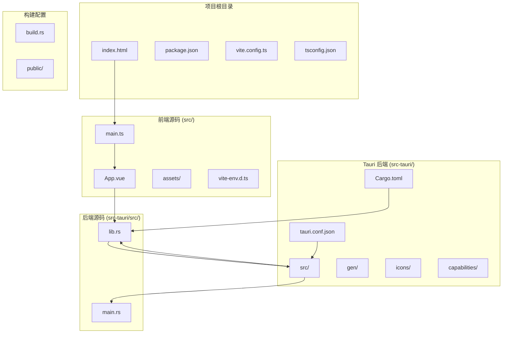
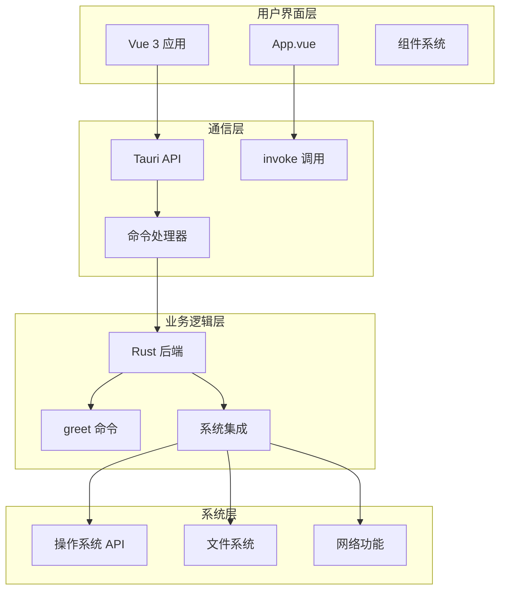
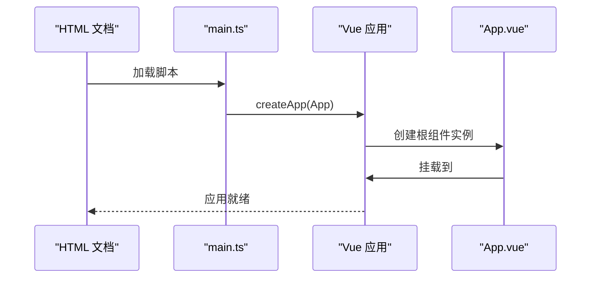
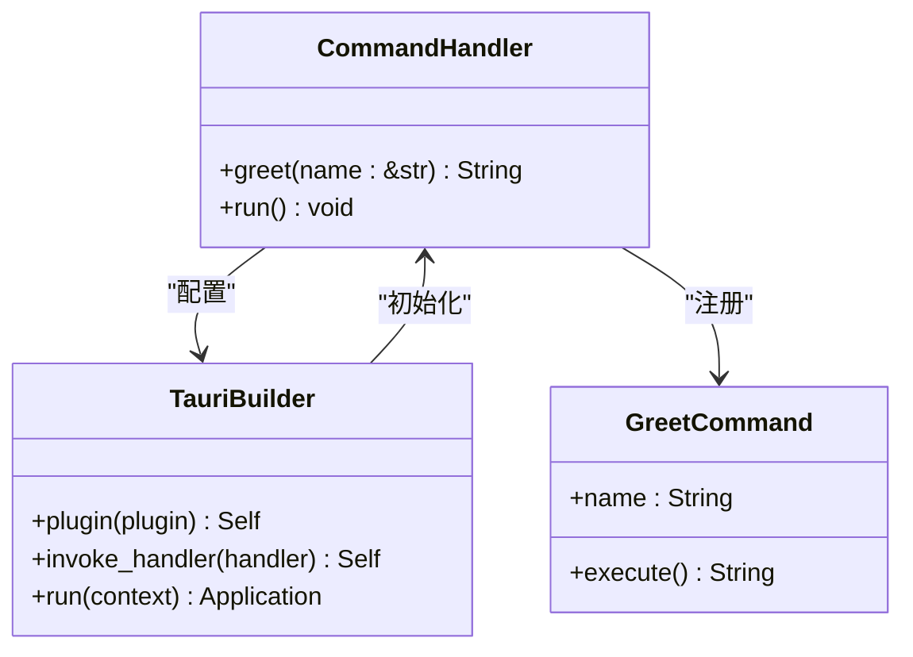

# 项目概述

<cite>
**本文档引用的文件**
- [README.md](file://README.md)
- [AGENTS.md](file://AGENTS.md)
- [package.json](file://package.json)
- [vite.config.ts](file://vite.config.ts)
- [tsconfig.json](file://tsconfig.json)
- [src/main.ts](file://src/main.ts)
- [src/App.vue](file://src/App.vue)
- [index.html](file://index.html)
- [src-tauri/Cargo.toml](file://src-tauri/Cargo.toml)
- [src-tauri/tauri.conf.json](file://src-tauri/tauri.conf.json)
- [src-tauri/src/lib.rs](file://src-tauri/src/lib.rs)
- [src-tauri/src/main.rs](file://src-tauri/src/main.rs)
- [src-tauri/build.rs](file://src-tauri/build.rs)
</cite>

## 目录
1. [引言](#引言)
2. [项目结构](#项目结构)
3. [核心组件](#核心组件)
4. [架构总览](#架构总览)
5. [详细组件分析](#详细组件分析)
6. [依赖关系分析](#依赖关系分析)
7. [性能考虑](#性能考虑)
8. [故障排除指南](#故障排除指南)
9. [结论](#结论)

## 引言

本项目是一个基于 Tauri 2 + Vue 3 + TypeScript 的跨平台桌面应用程序模板。该项目展示了现代桌面应用开发的最佳实践，通过将 Web 技术与原生系统能力相结合，实现了高性能、轻量级且安全的桌面应用体验。

### 核心目标

- **跨平台兼容性**：支持 Windows、macOS 和 Linux 平台
- **开发效率**：利用 Vue 3 的响应式特性和 TypeScript 的类型安全
- **性能优化**：通过 Tauri 2 的轻量级运行时减少资源占用
- **安全性**：默认启用安全策略，限制不必要的系统访问权限

### 技术架构选择

本项目采用"前端 Web 技术 + Rust 后端"的混合架构，这种组合在桌面应用开发中具有独特优势：

- **前端层**：Vue 3 提供现代化的组件化开发体验，TypeScript 确保类型安全
- **后端层**：Rust 通过 Tauri 2 提供系统级功能调用和安全沙箱
- **构建工具**：Vite 提供快速的开发服务器和高效的构建流程

## 项目结构

项目采用清晰的分层结构，将前端、后端和配置文件分离管理：



**图表来源**
- [index.html:1-15](file://index.html#L1-L15)
- [src/main.ts:1-5](file://src/main.ts#L1-L5)
- [src-tauri/src/lib.rs:1-15](file://src-tauri/src/lib.rs#L1-L15)
- [src-tauri/src/main.rs:1-7](file://src-tauri/src/main.rs#L1-L7)

### 文件组织原则

- **前端代码**：位于 `src/` 目录，遵循 Vue 3 单文件组件规范
- **后端代码**：位于 `src-tauri/` 目录，使用 Rust 语言实现
- **配置文件**：根目录下的各种配置文件管理构建和开发流程
- **静态资源**：`public/` 目录存放不需要构建处理的静态文件

**章节来源**
- [AGENTS.md:73-91](file://AGENTS.md#L73-L91)
- [package.json:1-25](file://package.json#L1-L25)
- [src-tauri/Cargo.toml:1-26](file://src-tauri/Cargo.toml#L1-L26)

## 核心组件

### 前端技术栈

项目采用现代化的前端技术栈，确保开发体验和应用性能：

- **Vue 3**：最新版本的 Vue 框架，提供 Composition API 和更好的 TypeScript 支持
- **TypeScript**：强类型语言，提供编译时错误检查和智能代码补全
- **Vite**：快速的构建工具和开发服务器，支持热模块替换(HMR)

### 后端技术栈

Rust 作为后端语言，通过 Tauri 2 提供系统级功能：

- **Tauri 2**：轻量级框架，替代 Electron，提供更好的性能和安全性
- **Rust 生态系统**：利用 serde 进行序列化，提供内存安全保证
- **插件系统**：支持扩展功能如文件打开器等

### 开发工具链

- **包管理**：pnpm 提供快速的依赖安装和链接
- **类型检查**：vue-tsc 确保 Vue 组件的类型安全
- **IDE 支持**：VS Code 扩展提供完整的开发体验

**章节来源**
- [AGENTS.md:5-9](file://AGENTS.md#L5-L9)
- [package.json:12-23](file://package.json#L12-L23)
- [src-tauri/Cargo.toml:20-25](file://src-tauri/Cargo.toml#L20-L25)

## 架构总览

项目采用客户端-服务端分离的架构模式，前端负责用户界面和交互逻辑，后端提供系统级功能和数据处理能力。



**图表来源**
- [src/App.vue:8-11](file://src/App.vue#L8-L11)
- [src-tauri/src/lib.rs:2-5](file://src-tauri/src/lib.rs#L2-L5)
- [src-tauri/src/lib.rs:8-14](file://src-tauri/src/lib.rs#L8-L14)

### 数据流架构

应用的数据流遵循单向数据流原则，从用户交互到系统响应的完整路径：

1. **用户交互**：Vue 组件接收用户输入和操作
2. **命令调用**：通过 Tauri API 发起 Rust 命令调用
3. **业务处理**：Rust 后端执行相应的业务逻辑
4. **结果返回**：处理结果通过异步回调返回给前端
5. **界面更新**：Vue 组件响应数据变化更新界面

**章节来源**
- [src/App.vue:1-160](file://src/App.vue#L1-L160)
- [src-tauri/src/lib.rs:1-15](file://src-tauri/src/lib.rs#L1-L15)

## 详细组件分析

### Vue 3 前端应用

Vue 3 应用作为用户界面的核心，提供了现代化的开发体验和强大的响应式系统。

#### 应用入口点

应用通过 `src/main.ts` 初始化，创建 Vue 应用实例并挂载到 DOM 元素。



**图表来源**
- [src/main.ts:1-5](file://src/main.ts#L1-L5)
- [index.html:10-13](file://index.html#L10-L13)

#### 主要组件结构

`src/App.vue` 是应用的主组件，展示了 Tauri 命令调用的基本模式：

- **响应式状态**：使用 `ref` 管理输入和输出状态
- **事件处理**：表单提交事件触发 Tauri 命令
- **异步调用**：通过 `invoke` 函数与 Rust 后端通信

**章节来源**
- [src/App.vue:1-160](file://src/App.vue#L1-L160)

### Tauri 后端架构

Rust 后端通过 Tauri 2 提供系统级功能，实现了安全的跨平台桌面应用。

#### 命令定义

`src-tauri/src/lib.rs` 定义了应用的核心命令：



**图表来源**
- [src-tauri/src/lib.rs:2-14](file://src-tauri/src/lib.rs#L2-L14)

#### 应用启动流程

应用启动时，`src-tauri/src/main.rs` 作为入口点调用库函数完成初始化。

**章节来源**
- [src-tauri/src/lib.rs:1-15](file://src-tauri/src/lib.rs#L1-L15)
- [src-tauri/src/main.rs:1-7](file://src-tauri/src/main.rs#L1-L7)

### 配置管理系统

项目通过多个配置文件管理不同的方面：

#### Vite 配置

`vite.config.ts` 提供了针对 Tauri 开发的优化配置：

- **固定端口**：开发服务器使用固定端口 1420
- **热重载**：支持 HMR 功能，提升开发效率
- **忽略监听**：避免监听 Rust 源码目录

#### TypeScript 配置

`tsconfig.json` 启用了严格的类型检查选项：

- **严格模式**：确保代码质量
- **模块解析**：使用 bundler 模式
- **无 emit**：仅进行类型检查

**章节来源**
- [vite.config.ts:1-33](file://vite.config.ts#L1-L33)
- [tsconfig.json:1-26](file://tsconfig.json#L1-L26)

## 依赖关系分析

项目依赖关系清晰明确，前后端分离但通过 Tauri API 紧密集成。

```mermaid
graph LR
subgraph "前端依赖"
A[Vue 3]
B[TypeScript]
C[Vite]
D[@tauri-apps/api]
end
subgraph "后端依赖"
E[Tauri 2]
F[serde]
G[serde_json]
H[tauri-plugin-opener]
end
subgraph "开发工具"
I[pnpm]
J[Vue CLI]
K[Rust]
end
A --> D
C --> I
E --> H
F --> G
```

**图表来源**
- [package.json:12-23](file://package.json#L12-L23)
- [src-tauri/Cargo.toml:17-25](file://src-tauri/Cargo.toml#L17-L25)

### 关键依赖特性

- **Vue 3 + TypeScript**：提供现代化的开发体验和类型安全保障
- **Tauri 2**：轻量级替代方案，相比 Electron 更加高效
- **pnpm**：快速包管理器，支持工作区和符号链接
- **Vite**：极速构建工具，支持热模块替换

**章节来源**
- [package.json:1-25](file://package.json#L1-L25)
- [src-tauri/Cargo.toml:1-26](file://src-tauri/Cargo.toml#L1-L26)

## 性能考虑

### 启动性能优化

- **延迟加载**：非关键功能按需加载
- **代码分割**：大型组件独立打包
- **缓存策略**：合理利用浏览器缓存

### 内存管理

- **垃圾回收**：利用 Rust 的内存安全特性
- **资源清理**：及时释放系统资源
- **内存监控**：定期检查内存使用情况

### 网络性能

- **HTTP 缓存**：合理设置缓存头
- **连接复用**：复用 HTTP 连接
- **压缩传输**：启用 Gzip 压缩

## 故障排除指南

### 常见开发问题

#### 端口冲突

当开发服务器无法启动时，检查端口 1420 是否被占用。

#### 类型检查错误

确保 TypeScript 配置正确，特别是模块解析和严格模式设置。

#### Tauri 命令调用失败

验证命令名称是否匹配，检查参数传递格式。

### 构建问题

#### 前端构建失败

检查 Vite 配置和依赖版本兼容性。

#### Rust 构建失败

确认 Rust 工具链版本和 Tauri 插件配置。

**章节来源**
- [AGENTS.md:11-34](file://AGENTS.md#L11-L34)

## 结论

本项目展示了 Tauri 2 + Vue 3 + TypeScript 桌面应用开发的最佳实践。通过合理的架构设计和技术选型，实现了高性能、安全可靠的跨平台桌面应用。

### 主要优势

- **性能优异**：相比传统桌面应用框架，Tauri 2 提供更好的性能表现
- **开发友好**：现代化的开发工具链，提升开发效率
- **类型安全**：完整的 TypeScript 支持，确保代码质量
- **跨平台**：一次开发，多平台部署

### 适用场景

- **生产力工具**：文本编辑器、代码编辑器等
- **数据分析应用**：需要本地数据处理的工具
- **游戏和娱乐**：轻量级游戏和多媒体应用
- **企业内部工具**：定制化的办公软件

该架构为桌面应用开发提供了坚实的基础，既适合初学者学习，也为有经验的开发者提供了足够的灵活性和扩展空间。